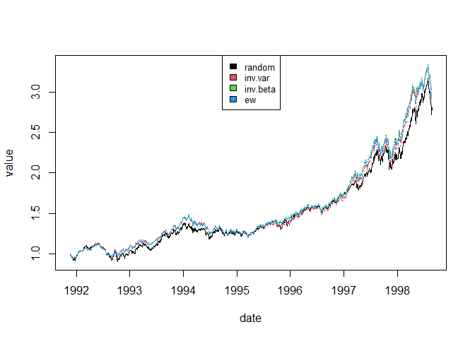

portfoliopy.py
================

## Set up and data

I tested the Python functions in R using the reticulate library. First I
load the necessary libraries and sources, and then the data I will be
using

``` r
library(reticulate)
```

    ## Warning: package 'reticulate' was built under R version 4.0.5

``` r
source_python("portfoliopy.py")
prices=as.data.frame(EuStockMarkets)
matplot(x=1:nrow(prices),y=apply(prices,2,function(x)x/x[1]),col=1:ncol(prices),type="l",
        xlab="index",ylab="value")
legend("top", colnames(prices),col=seq_len(ncol(prices)),cex=0.8,fill=seq_len(ncol(prices)))
```

<!-- -->

## Testing the portfolio functions with the included portfolio functions

Note that when using reticulate, to pass integers to Python functions,
we have to specify “as.integer(x)”.

``` r
sr<-prices2sreturns(prices)
ew.sr<-equal_weights_portfolio(sr)
ew.w<-sreturns2wealth(ew.sr)

rand.sr<-backtest_strategy(random_strategy,sr,forward=as.integer(100),args=as.integer(2))
rand.w<-sreturns2wealth(rand.sr)

inv.var.sr<-backtest_strategy(inv_V_strategy,sr,forward=as.integer(100),args=NULL)
inv.var.w<-sreturns2wealth(inv.var.sr)

inv.beta.sr<-backtest_strategy(inv_B_strategy,sr,forward=as.integer(100),args=NULL)
inv.beta.w<-sreturns2wealth(inv.beta.sr)

ports<-cbind(random=rand.w,inv.var=inv.var.w,inv.beta=inv.beta.w,
             ew=tail(ew.w,length(rand.w))/tail(ew.w,length(rand.w))[1])
matplot(x=1:length(rand.w),y=ports,col=1:ncol(ports),type="l",xlab="index",ylab="value")

legend("top", colnames(ports),col=seq_len(ncol(ports)),cex=0.8,fill=seq_len(ncol(ports)))
```

<!-- -->
